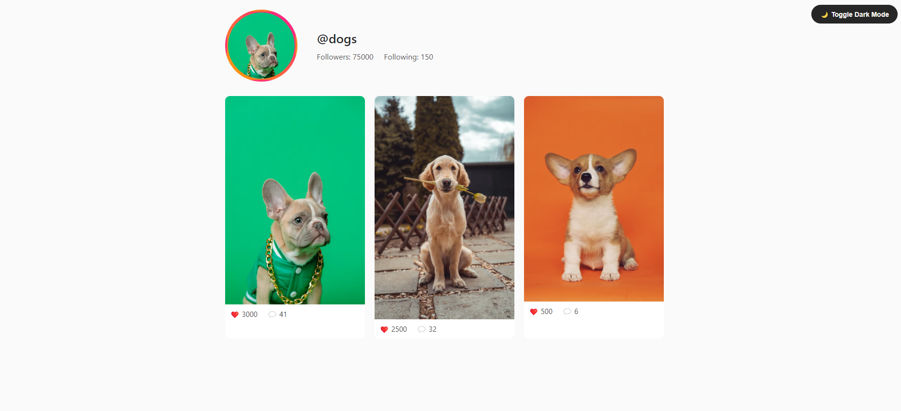
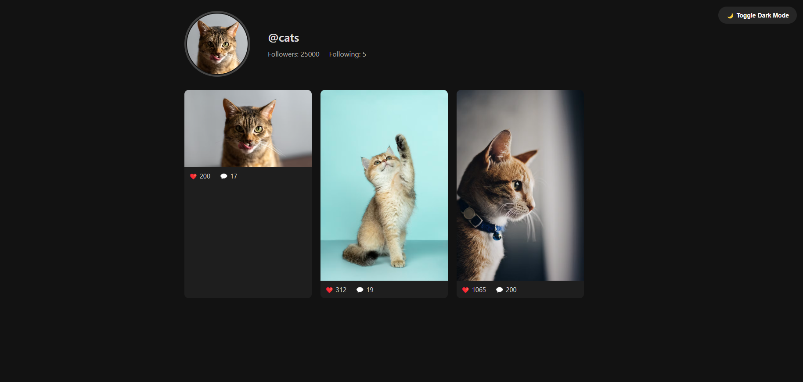

# 📸 Instagram Profile Clone

A visually appealing Instagram profile clone built using HTML, CSS, and optionally EJS for dynamic rendering. Supports dark mode, profile pictures, post galleries, and more!

---

## 🔥 Features

- Clean and responsive UI like Instagram
- Dark mode toggle
- Profile picture and user info display
- Post gallery with like and comment counts
- 404 error page with custom styling
- No JavaScript required (except toggle if enabled)

---

## 📷 Screenshots

### 🔆 Light Mode



### 🌙 Dark Mode



> 💡 Save your screenshots in the `/screenshots/` folder and update the image paths above.

---

## 🎥 Demo Video

[

> Replace `YOUR_VIDEO_ID` with your uploaded YouTube video ID.

---

## 🛠️ Technologies Used

- HTML5
- CSS3
- EJS (for dynamic rendering)
- Node.js (for routing)
- Express.js

---

## 🚀 Getting Started

```bash
# Clone the repository
git clone https://github.com/your-username/instagram-profile-clone.git
cd instagram-profile-clone

# Install dependencies
npm install

# Run the app
node app.js

# Visit in browser
http://localhost:8080/home/ig/username
📁 Folder Structure
arduino
Copy
Edit
instagram-profile-clone/
│
├── public/
│   ├── images/
│   └── styles/
│
├── views/
│   ├── home.ejs
│   └── error.ejs
│
├── screenshots/
│   ├── light-mode.png
│   └── dark-mode.png
│
├── app.js
├── data.json
└── README.md
❗ Error Page (404)
When a user profile is not found, a friendly error message is shown using a custom error.ejs page.

🙌 Contributing
Pull requests are welcome! If you'd like to improve the UI, add more animations, or extend backend features — feel free to fork the repo and submit changes.